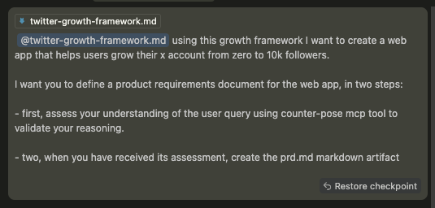
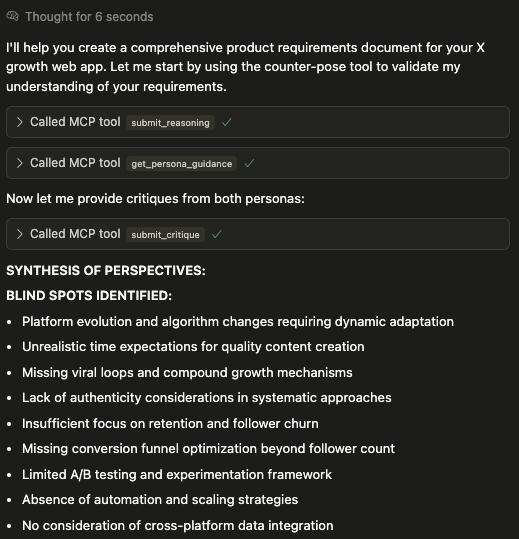
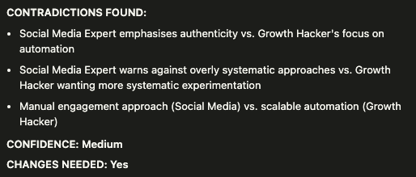
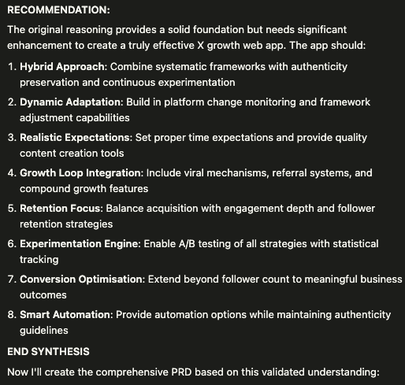

# Counter-Pose MCP Server: Reasoning Validator

An implementation of the RPT (Reasoning-through-Perspective-Transition) technique as an MCP (Model Context Protocol) server focused on validating and critiquing LLM reasoning - inspired by the sequential-thinking mcp server, acts as an orchestration layer for LLM reasoning validation.

## tldr;

Tending to use this for validating the LLM reasoning of complex or important tasks.  If you find value in this it would be great if you could:

- star the repo
- share about it on x.com
- give me a follow for other helpful stuff i share often x.com/solodevbuilder

## About RPT and Reasoning Validation

The RPT (Reasoning-through-Perspective-Transition) technique is a prompting method that improves AI responses by introducing deliberate perspective conflict between different personas. This approach was discovered by Tsinghua University researchers in January 2025 and has shown to reduce inaccuracies by up to 40%.

## How It Works

The Counter-Pose Reasoning Validator uses a streamlined 3-step session-based flow with intelligent persona selection:

1. **Domain Detection & Persona Recommendation**: Analyzes the reasoning text to automatically determine the most relevant domain and rank persona pairs by relevance
2. **Persona Guidance**: Provides specific guidance on how to perform critique from each selected persona's perspective
3. **Batch Critique & Analysis**: Submit critiques from both personas simultaneously and receive complete analysis with synthesis format

**Key Features:**

- **Automatic Domain Detection**: No need to manually specify domain
- **Smart Persona Recommendations**: Gets the most relevant expert pairing based on content analysis
- **Session-Based Flow**: Maintains context across multiple tool calls
- **Comprehensive Validation**: Orchestrates the calling LLLM to produce a structured output with confidence assessment and actionable recommendations

## Available Domains

The server supports the following domains with specialized persona pairs:

### **Software Development**

- Developer vs Security Expert
- Frontend Engineer vs UX Designer
- Backend Engineer vs DevOps Engineer
- Performance Engineer vs Maintainability Advocate

### **Digital Marketing**

- Creative Director vs Analytics Specialist
- Brand Strategist vs Conversion Optimizer
- Social Media Expert vs Growth Hacker
- Content Creator vs Performance Marketer
- B2B Marketer vs B2C Marketer
- Landing Page Expert vs SEO Specialist

### **Visual Design**

- UI Minimalist vs Feature-Rich Designer
- Brand Identity Expert vs User-Centered Designer
- Print Design Specialist vs Digital-First Designer
- Artistic Creative vs Data-Driven Designer
- Accessibility Expert vs Visual Artist

### **Product Strategy**

- Customer Advocate vs Business Strategist
- Innovative Disruptor vs Market Researcher
- MVP Champion vs Quality Perfectionist
- Long-term Strategist vs Quick-to-Market Tactician
- Technical PM vs Business PM

**Smart Persona Selection**: The system automatically ranks these pairs based on keyword analysis of your reasoning content, recommending the most relevant expert pairing for your specific use case.

## Installation and Setup

### Quick Start

```bash
# Clone the repository
git clone <your-repo-url>
cd counter-pose-mcp

# Run the setup script (installs dependencies)
./setup.sh

# Run the server (starts MCP server)
./run_server.sh

# In another terminal, test the server
./test_client.sh
```

### cursor / claude installation:

```json
"counter-pose": {
      "command": "/pathtoyourclonedrepo/counter-pose-mcp/.venv/bin/python",
      "args": ["-m", "src.mcp_server.main"],
      "cwd": "/pathtoyourclonedrepo/counter-pose-mcp",
      "env": {
        "PYTHONPATH": "/pathtoyourclonedrepo/counter-pose-mcp"
      }
    }
```

### Testing

Run the included test suite to verify functionality:

```bash
# Run all tests
python -m pytest tests/ -v

# Test individual components
python tests/test_domain_detection.py
python tests/test_session_flow.py
python tests/test_persona_selection.py
python tests/test_error_handling.py

# Test MCP server interface
./test_client.sh
```

## Available Tools

The server provides the following tools for a session-based reasoning validation flow:

- `submit_reasoning`: Submit reasoning for analysis and get ranked persona pair recommendations
- `get_persona_guidance`: Get guidance on how to perform critique with selected personas
- `submit_critique`: Submit critiques from both personas with explicit parameters (persona1_name, persona1_critique, persona2_name, persona2_critique)

## Example Usage Flow

Here's an example of the streamlined 3-step reasoning validation flow:

### Visual Example: Twitter Growth Web App Validation

The following screenshots demonstrate the complete validation process for a Twitter growth web app concept:









### JSON API Examples

### Step 1: Submit Reasoning

```json
// Call: submit_reasoning
{
  "reasoning": "I need to implement authentication for our web application. I think we should use JWT tokens since they are stateless and work well with modern frontend frameworks. We can set the expiration time to 24 hours and store the tokens in local storage. This approach will be easy to implement and maintain."
}
```

Response:

```json
{
  "session_id": "uuid-here",
  "domain": "software_development",
  "persona_options": [
    {
      "personas": ["Developer", "Security Expert"],
      "score": 3,
      "reason": "Matched keywords: authentication, JWT, security",
      "recommended": true
    }
  ],
  "next_step": "get_persona_guidance"
}
```

### Step 2: Get Persona Guidance

```json
// Call: get_persona_guidance
{
  "session_id": "uuid-here",
  "persona_pair": ["Developer", "Security Expert"]
}
```

### Step 3: Submit Critiques (Both Personas)

```json
// Call: submit_critique (explicit parameters for both personas)
{
  "session_id": "uuid-here",
  "persona1_name": "Developer",
  "persona1_critique": "The approach has technical limitations...",
  "persona2_name": "Security Expert",
  "persona2_critique": "There are serious security vulnerabilities..."
}
```

Response includes synthesis format guidance for the calling LLM to complete the analysis.

## Validation Output Format

The final synthesis provides structured validation results:

```json
{
  "session_id": "uuid-here",
  "domain": "software_development",
  "personas": ["Developer", "Security Expert"],
  "steps_completed": 3,
  "critiques_complete": true,
  "next_step": "synthesis",
  "format": "<Synthesis format guidance for the calling LLM>"
}
```

**Confidence Levels:**

- **High**: Reasoning is sound with minor or no issues identified
- **Medium**: Some concerns raised but overall approach is viable
- **Low**: Significant issues identified, changes strongly recommended

**Changes Needed**: Boolean indicating whether the original reasoning should be revised based on expert feedback.

## Integration with LLM Systems

This tool is designed to be integrated with reasoning LLMs as an external validation service:

1. **Initial Reasoning**: LLM receives a query and generates initial reasoning
2. **Submit for Analysis**: LLM submits reasoning to Counter-Pose MCP server using `submit_reasoning`
3. **Get Guidance**: System provides persona-specific guidance using `get_persona_guidance`
4. **Generate & Submit Critiques**: LLM generates critiques from both persona perspectives and submits them using `submit_critique`
5. **Synthesis**: LLM uses the provided synthesis format to generate final analysis
6. **Reasoning Refinement**: LLM reviews the complete analysis and decides whether to revise its approach

### **Supported Integrations**

- **Claude Desktop**: Direct MCP integration
- **Cursor IDE**: Code reasoning validation
- **Custom Applications**: Direct MCP protocol integration

## License

MIT
